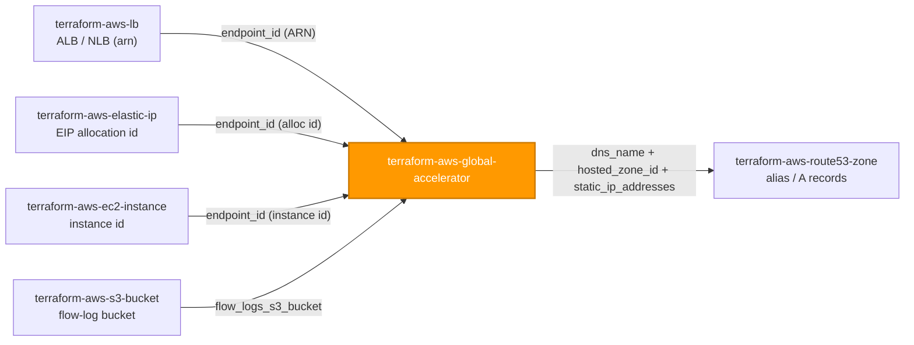
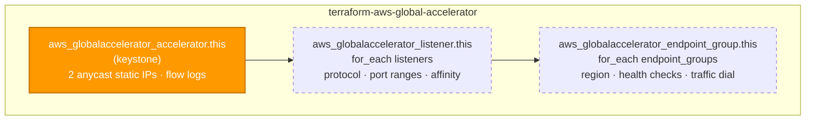

# 🟧 AWS **Global Accelerator** Terraform Module

> **Provisions a single AWS Global Accelerator — its two anycast static IPs, its listeners, and its per-region endpoint groups — so one module call yields a global, fault-tolerant, health-checked L4 traffic-entry point in front of your ALBs / NLBs / EIPs / EC2 instances.** Built for the AWS provider **v6.x**.

[](https://www.terraform.io)
[](https://registry.terraform.io/providers/hashicorp/aws/latest)
[](#)
[](#)
[](#)

---

## 🧩 Overview

- 🌍 **One accelerator, fully wired.** Creates `aws_globalaccelerator_accelerator` plus everything meaningless without it: its `aws_globalaccelerator_listener` set and its `aws_globalaccelerator_endpoint_group` set.
- 📡 **Two static anycast IPs.** Every accelerator gets two AWS-owned anycast addresses (or your BYOIP set) advertised from the AWS global edge network — stable entry points you can hard-code in DNS A records and partner allow-lists.
- ⚡ **Edge-optimized L4 routing.** Client traffic enters at the nearest AWS edge PoP and rides the AWS backbone to the closest healthy regional endpoint — lower latency and jitter than public-internet transit.
- 🩺 **Health-checked failover by default.** Endpoint groups health-check their targets and shift traffic away from unhealthy Regions automatically; `traffic_dial_percentage` and endpoint `weight` give you blue/green and gradual-cutover control.
- 🔑 **Key-based listener wiring.** Endpoint groups reference their parent listener by a stable `listener_key`; the module resolves the key to the created listener ARN for you — no two-pass wiring.
- 📝 **Flow logs on demand.** Supply an S3 bucket and flow logs are enabled automatically (the auditability baseline); omit it and they stay off.
- 🏷️ **Tags on the accelerator.** `var.tags` merges with provider `default_tags` and is surfaced as `tags_all`. (Global Accelerator **listeners and endpoint groups are not taggable** — AWS limitation.)
- 🇺🇸 **us-west-2 control plane.** Global Accelerator is a global service whose control-plane API lives in `us-west-2`; the module relies on provider inheritance and declares **no `region` variable** — pass a `us-west-2` provider alias if your default region differs.

> 💡 **Why it matters:** Global Accelerator is the global front door for latency-sensitive and multi-Region workloads. A single secure-by-default module keeps anycast IPs, health checks, flow logs, and failover behavior consistent — so a member-facing service fails over between Regions and stays reachable on a fixed IP pair, instead of depending on slow DNS propagation or ad-hoc per-team wiring.

---

## ❤️ Support this project

If these Terraform modules have been helpful to you or your organization, I'd appreciate your support in any of the following ways:

- ⭐ **Star this repository** to help others discover this Terraform module.
- 🤝 **Connect with me on LinkedIn:** [linkedin.com/in/microsoftexpert](https://www.linkedin.com/in/microsoftexpert)
- ☕ **Buy me a coffee:** [buymeacoffee.com/microsoftexpert](https://buymeacoffee.com/microsoftexpert)

Whether it's a star, a professional connection, or a coffee, every gesture helps keep these modules actively maintained and continually improving. Thank you for being part of the community!

---

## 🗺️ Where this fits in the family

`terraform-aws-global-accelerator` is an **edge module** — it consumes regional endpoints (ALB/NLB by ARN, EIP by allocation id, EC2 by instance id) and an optional flow-log bucket from upstream siblings, and is itself consumed only by DNS (Route 53 records pointing at the accelerator).



---

## 🧬 What this module builds



| Resource | Count | Created when |
|---|---|---|
| `aws_globalaccelerator_accelerator.this` | 1 | always (keystone) |
| `aws_globalaccelerator_listener.this` | 0..N | one per `listeners` entry |
| `aws_globalaccelerator_endpoint_group.this` | 0..N | one per `endpoint_groups` entry |

Each endpoint group names its parent listener via `listener_key`; the module maps that stable string to the created listener's ARN, so you never wire ARNs by hand. An accelerator with no listeners is valid but serves no traffic.

---

## ✅ Provider / Versions

| Requirement | Version |
|---|---|
| Terraform | `>= 1.12.0` |
| `hashicorp/aws` | `>= 6.0, < 7.0` |

The module declares only a `required_providers` block (`providers.tf`) — **no `provider {}` block**, **no `configuration_aliases`**, and **no credential variable**. Credentials resolve through the standard AWS chain at the root/pipeline level (env vars → SSO/shared credentials → `assume_role` → instance profile / IRSA → OIDC web identity). Because the Global Accelerator API is hosted in `us-west-2`, point the module's provider at that Region — directly or via an alias:

```hcl
# In the caller's root module, when the default region is NOT us-west-2:
provider "aws" {} # your working region
provider "aws" { alias = "us_west_2", region = "us-west-2" }

module "global_accelerator" {
 source = "git::https://github.com/microsoftexpert/terraform-aws-global-accelerator?ref=v1.0.0"
 providers = { aws = aws.us_west_2 }
 #...
}
```

---

## 🔑 Required IAM Permissions

Least-privilege actions the **Terraform execution identity** needs to manage this module. Global Accelerator is a **global** service — its IAM actions are not region-scoped, but the control-plane API is reached in `us-west-2`.

| Action | Required for | Notes |
|---|---|---|
| `globalaccelerator:CreateAccelerator`, `globalaccelerator:UpdateAccelerator`, `globalaccelerator:DescribeAccelerator`, `globalaccelerator:DeleteAccelerator` | Accelerator lifecycle | Core CRUD on the keystone |
| `globalaccelerator:UpdateAcceleratorAttributes`, `globalaccelerator:DescribeAcceleratorAttributes` | Flow-log attributes | Only when `flow_logs_s3_bucket` is set |
| `globalaccelerator:TagResource`, `globalaccelerator:UntagResource`, `globalaccelerator:ListTagsForResource` | Tagging | Only the accelerator is taggable |
| `globalaccelerator:CreateListener`, `globalaccelerator:UpdateListener`, `globalaccelerator:DescribeListener`, `globalaccelerator:DeleteListener` | Listener lifecycle | Only when `listeners` set |
| `globalaccelerator:CreateEndpointGroup`, `globalaccelerator:UpdateEndpointGroup`, `globalaccelerator:DescribeEndpointGroup`, `globalaccelerator:DeleteEndpointGroup` | Endpoint-group lifecycle | Only when `endpoint_groups` set |
| `elasticloadbalancing:DescribeLoadBalancers` | Resolving ALB/NLB endpoints | On endpoints referenced by ARN |
| `ec2:DescribeAddresses` | Resolving EIP endpoints | On endpoints referenced by allocation id |
| `ec2:DescribeInstances` | Resolving EC2 endpoints | On endpoints referenced by instance id |
| `s3:PutBucketPolicy`, `s3:GetBucketPolicy` | Flow-log delivery to S3 | Only if this identity also manages the flow-log bucket policy (preferably owned by `terraform-aws-s3-bucket`) |

> 🔒 **No service-linked role** is created by this module, and Global Accelerator requires none. Client IP preservation does **not** need an extra IAM action here, but it changes the security posture of the *endpoint's* security group — see Prerequisites.

---

## 📋 AWS Prerequisites

- **🇺🇸 us-west-2 control plane (mandatory).** Global Accelerator is a single global service whose control-plane API is hosted in **`us-west-2`**. The accelerator itself is global (anycast from the edge network); endpoint groups can target **any** Region. Point the module's provider at `us-west-2` (directly or via an alias). **Do NOT add a `region` variable** — Region for the accelerator is expressed through the provider, and per-endpoint-group Region is set with `endpoint_group_region`.
- **No service-linked role** is required for Global Accelerator.
- **Endpoints must pre-exist.** ALB/NLB (`terraform-aws-lb`), Elastic IPs (`terraform-aws-elastic-ip`), or EC2 instances (`terraform-aws-ec2-instance`) must already exist and be referenced by ARN / allocation id / instance id. An NLB/ALB endpoint must be in the `endpoint_group_region` of its group.
- **Client IP preservation security-group impact.** When `client_ip_preservation_enabled = true` for an ALB/EC2 endpoint, the **client's** source IP reaches the endpoint — so the endpoint's security group must allow the real client CIDRs (or the Global Accelerator managed prefix list, `com.amazonaws.global.globalaccelerator`), **not** the accelerator's IPs. Preservation effectively bypasses any allow-list keyed on the accelerator addresses — review the endpoint SGs before enabling it ([guidelines](https://docs.aws.amazon.com/global-accelerator/latest/dg/preserve-client-ip-address.how-to-enable-preservation.html)). NLB endpoints preserve client IP inherently.
- **Flow logs (optional).** Supplying `flow_logs_s3_bucket` enables flow logs; the bucket must already exist with a policy granting the Global Accelerator service write access under the configured `flow_logs_s3_prefix`. Wire the bucket from `terraform-aws-s3-bucket`.
- **BYOIP (optional).** To pin your own addresses via `ip_addresses`, the IPv4 range must already be provisioned and advertised to Global Accelerator through BYOIP; otherwise AWS assigns the two anycast IPs.
- **Quotas** (per [Global Accelerator quotas](https://docs.aws.amazon.com/global-accelerator/latest/dg/limits-global-accelerator.html); raisable via Service Quotas):
 - **10 accelerators** per account.
 - **10 listeners** per accelerator.
 - **10 endpoint groups** per listener (one per Region).
 - **10 endpoints** per endpoint group.

---

## 📁 Module Structure

```
terraform-aws-global-accelerator/
├── providers.tf # required_providers (aws >= 6.0, < 7.0); no provider block; us-west-2 note
├── variables.tf # name → accelerator scalars → flow logs → listeners → endpoint_groups → tags → timeouts
├── main.tf # aws_globalaccelerator_accelerator.this + listener / endpoint_group for_each
├── outputs.tf # id + arn + dns_name + hosted_zone_id + static_ip_addresses + child-collection maps + tags_all
├── README.md # this file
└── SCOPE.md # in/out-of-scope, IAM permissions, prerequisites, gotchas
```

---

## ⚙️ Quick Start

Smallest working call — a single TCP/443 listener fronting an ALB in one Region:

```hcl
module "global_accelerator" {
  source    = "git::https://github.com/microsoftexpert/terraform-aws-global-accelerator?ref=v1.0.0"
  providers = { aws = aws.us_west_2 } # GA control plane is us-west-2

  name = "casey-web-ga"

  listeners = {
    https = {
      protocol    = "TCP"
      port_ranges = [{ from_port = 443, to_port = 443 }]
    }
  }

  endpoint_groups = {
    primary = {
      listener_key          = "https"
      endpoint_group_region = "us-east-1"
      health_check_protocol = "HTTPS"
      health_check_path     = "/health"
      endpoints = [
        { endpoint_id = module.alb.arn } # ALB ARN from terraform-aws-lb
      ]
    }
  }

  tags = { Environment = "prod", DataClass = "internal" }
}
```

---

## 🔌 Cross-Module Contract

### Consumes

| Input | Type | Source module |
|---|---|---|
| `endpoint_groups[*].endpoints[*].endpoint_id` | `string` (ALB/NLB ARN) | `terraform-aws-lb` |
| `endpoint_groups[*].endpoints[*].endpoint_id` | `string` (EIP allocation id) | `terraform-aws-elastic-ip` |
| `endpoint_groups[*].endpoints[*].endpoint_id` | `string` (EC2 instance id) | `terraform-aws-ec2-instance` |
| `flow_logs_s3_bucket` | `string` (bucket name) | `terraform-aws-s3-bucket` |

### Emits

| Output | Description | Consumed by |
|---|---|---|
| `id` | Accelerator id (its ARN) | listener / endpoint-group wiring, references |
| `arn` | Accelerator ARN (`arn:aws:globalaccelerator::<acct>:accelerator/<uuid>`, no region segment) — the cross-resource reference type | IAM policies, monitoring |
| `name` | Accelerator name | tagging, monitoring |
| `enabled` | Whether the accelerator is enabled | operational verification |
| `dns_name` | Accelerator DNS name (`a…awsglobalaccelerator.com`) | Route 53 alias / CNAME records |
| `dual_stack_dns_name` | IPv4+IPv6 DNS name (set when `ip_address_type = DUAL_STACK`) | dual-stack DNS records |
| `hosted_zone_id` | Global Accelerator hosted zone id | Route 53 alias records |
| `static_ip_addresses` | Flattened list of the two anycast static IPs | DNS A records, partner allow-lists |
| `ip_sets` | Full IP sets (`ip_addresses` + `ip_family`) | inspection / dual-stack wiring |
| `listener_ids` / `listener_arns` | Maps of listener key → id / ARN | endpoint-group references, inspection |
| `endpoint_group_ids` / `endpoint_group_arns` | Maps of endpoint-group key → id / ARN | monitoring, inspection |
| `tags_all` | All tags incl. provider `default_tags` (resource tags win) | governance/audit |

---

## 📚 Example Library

<details>
<summary><strong>1 · Minimal — one TCP listener, one ALB endpoint group</strong></summary>

```hcl
module "global_accelerator" {
  source    = "git::https://github.com/microsoftexpert/terraform-aws-global-accelerator?ref=v1.0.0"
  providers = { aws = aws.us_west_2 }

  name = "casey-app-ga"

  listeners = {
    https = { protocol = "TCP", port_ranges = [{ from_port = 443, to_port = 443 }] }
  }

  endpoint_groups = {
    use1 = {
      listener_key          = "https"
      endpoint_group_region = "us-east-1"
      endpoints             = [{ endpoint_id = module.alb.arn }]
    }
  }
}
```
</details>

<details>
<summary><strong>2 · Multi-Region active/active failover (two endpoint groups, one listener)</strong></summary>

```hcl
module "global_accelerator" {
  source    = "git::https://github.com/microsoftexpert/terraform-aws-global-accelerator?ref=v1.0.0"
  providers = { aws = aws.us_west_2 }

  name = "casey-ha-ga"

  listeners = {
    https = { protocol = "TCP", port_ranges = [{ from_port = 443, to_port = 443 }] }
  }

  endpoint_groups = {
    use1 = {
      listener_key          = "https"
      endpoint_group_region = "us-east-1"
      health_check_protocol = "HTTPS"
      health_check_path     = "/health"
      endpoints             = [{ endpoint_id = module.alb_use1.arn }] # from terraform-aws-lb (us-east-1)
    }
    usw2 = {
      listener_key          = "https"
      endpoint_group_region = "us-west-2"
      health_check_protocol = "HTTPS"
      health_check_path     = "/health"
      endpoints             = [{ endpoint_id = module.alb_usw2.arn }] # from terraform-aws-lb (us-west-2)
    }
  }
}
# Global Accelerator routes each client to the nearest HEALTHY group and fails over automatically.
```
</details>

<details>
<summary><strong>3 · Gradual cutover with a traffic dial (blue/green by Region)</strong></summary>

```hcl
module "global_accelerator" {
  source    = "git::https://github.com/microsoftexpert/terraform-aws-global-accelerator?ref=v1.0.0"
  providers = { aws = aws.us_west_2 }

  name = "casey-cutover-ga"

  listeners = {
    https = { protocol = "TCP", port_ranges = [{ from_port = 443, to_port = 443 }] }
  }

  endpoint_groups = {
    blue = {
      listener_key            = "https"
      endpoint_group_region   = "us-east-1"
      traffic_dial_percentage = 90 # bulk of traffic still on blue
      endpoints               = [{ endpoint_id = module.alb_blue.arn }]
    }
    green = {
      listener_key            = "https"
      endpoint_group_region   = "us-west-2"
      traffic_dial_percentage = 10 # canary the new Region
      endpoints               = [{ endpoint_id = module.alb_green.arn }]
    }
  }
}
```
</details>

<details>
<summary><strong>4 · Weighted endpoints within one group</strong></summary>

```hcl
module "global_accelerator" {
  source    = "git::https://github.com/microsoftexpert/terraform-aws-global-accelerator?ref=v1.0.0"
  providers = { aws = aws.us_west_2 }

  name = "casey-weighted-ga"

  listeners = {
    tcp = { protocol = "TCP", port_ranges = [{ from_port = 80, to_port = 80 }] }
  }

  endpoint_groups = {
    use1 = {
      listener_key          = "tcp"
      endpoint_group_region = "us-east-1"
      endpoints = [
        { endpoint_id = module.alb_a.arn, weight = 200 }, # ~2/3 of traffic
        { endpoint_id = module.alb_b.arn, weight = 100 }, # ~1/3 of traffic
      ]
    }
  }
}
```
</details>

<details>
<summary><strong>5 · NLB endpoint with a UDP listener (e.g. QUIC / game / VoIP)</strong></summary>

```hcl
module "global_accelerator" {
  source    = "git::https://github.com/microsoftexpert/terraform-aws-global-accelerator?ref=v1.0.0"
  providers = { aws = aws.us_west_2 }

  name = "casey-udp-ga"

  listeners = {
    udp = {
      protocol    = "UDP"
      port_ranges = [{ from_port = 7000, to_port = 7100 }]
    }
  }

  endpoint_groups = {
    use1 = {
      listener_key          = "udp"
      endpoint_group_region = "us-east-1"
      health_check_protocol = "TCP"                              # NLB health checks are TCP
      endpoints             = [{ endpoint_id = module.nlb.arn }] # NLB preserves client IP inherently
    }
  }
}
```
</details>

<details>
<summary><strong>6 · Source-IP stickiness (client_affinity)</strong></summary>

```hcl
module "global_accelerator" {
  source    = "git::https://github.com/microsoftexpert/terraform-aws-global-accelerator?ref=v1.0.0"
  providers = { aws = aws.us_west_2 }

  name = "casey-sticky-ga"

  listeners = {
    https = {
      protocol        = "TCP"
      client_affinity = "SOURCE_IP" # two-tuple hash: same client → same endpoint
      port_ranges     = [{ from_port = 443, to_port = 443 }]
    }
  }

  endpoint_groups = {
    use1 = {
      listener_key          = "https"
      endpoint_group_region = "us-east-1"
      endpoints             = [{ endpoint_id = module.alb.arn }]
    }
  }
}
```
</details>

<details>
<summary><strong>7 · Port overrides (listener 443 → endpoint 8443)</strong></summary>

```hcl
module "global_accelerator" {
  source    = "git::https://github.com/microsoftexpert/terraform-aws-global-accelerator?ref=v1.0.0"
  providers = { aws = aws.us_west_2 }

  name = "casey-portmap-ga"

  listeners = {
    https = { protocol = "TCP", port_ranges = [{ from_port = 443, to_port = 443 }] }
  }

  endpoint_groups = {
    use1 = {
      listener_key          = "https"
      endpoint_group_region = "us-east-1"
      endpoints             = [{ endpoint_id = module.alb.arn }]
      port_overrides = [
        { listener_port = 443, endpoint_port = 8443 } # forward to a non-standard endpoint port
      ]
    }
  }
}
```
</details>

<details>
<summary><strong>8 · Client IP preservation on an ALB endpoint</strong></summary>

```hcl
module "global_accelerator" {
  source    = "git::https://github.com/microsoftexpert/terraform-aws-global-accelerator?ref=v1.0.0"
  providers = { aws = aws.us_west_2 }

  name = "casey-clientip-ga"

  listeners = {
    https = { protocol = "TCP", port_ranges = [{ from_port = 443, to_port = 443 }] }
  }

  endpoint_groups = {
    use1 = {
      listener_key          = "https"
      endpoint_group_region = "us-east-1"
      endpoints = [
        # The ALB security group must now allow real client CIDRs (or the GA managed
        # prefix list) — NOT the accelerator IPs. See AWS Prerequisites.
        { endpoint_id = module.alb.arn, client_ip_preservation_enabled = true }
      ]
    }
  }
}
```
</details>

<details>
<summary><strong>9 · EIP / EC2 instance endpoints</strong></summary>

```hcl
module "global_accelerator" {
  source    = "git::https://github.com/microsoftexpert/terraform-aws-global-accelerator?ref=v1.0.0"
  providers = { aws = aws.us_west_2 }

  name = "casey-eip-ga"

  listeners = {
    tcp = { protocol = "TCP", port_ranges = [{ from_port = 22, to_port = 22 }] }
  }

  endpoint_groups = {
    use1 = {
      listener_key          = "tcp"
      endpoint_group_region = "us-east-1"
      endpoints = [
        { endpoint_id = module.bastion_eip.allocation_id }, # from terraform-aws-elastic-ip
        { endpoint_id = module.jump_box.id, weight = 0 },   # from terraform-aws-ec2-instance (drained)
      ]
    }
  }
}
```
</details>

<details>
<summary><strong>10 · Flow logs to S3 (secure-by-default auditability)</strong></summary>

```hcl
module "global_accelerator" {
  source    = "git::https://github.com/microsoftexpert/terraform-aws-global-accelerator?ref=v1.0.0"
  providers = { aws = aws.us_west_2 }

  name = "casey-logged-ga"

  # Supplying the bucket turns flow logs ON automatically.
  flow_logs_s3_bucket = module.ga_log_bucket.id # from terraform-aws-s3-bucket
  flow_logs_s3_prefix = "global-accelerator/"

  listeners = {
    https = { protocol = "TCP", port_ranges = [{ from_port = 443, to_port = 443 }] }
  }

  endpoint_groups = {
    use1 = {
      listener_key          = "https"
      endpoint_group_region = "us-east-1"
      endpoints             = [{ endpoint_id = module.alb.arn }]
    }
  }
}
```
</details>

<details>
<summary><strong>11 · Dual-stack accelerator (IPv4 + IPv6)</strong></summary>

```hcl
module "global_accelerator" {
  source    = "git::https://github.com/microsoftexpert/terraform-aws-global-accelerator?ref=v1.0.0"
  providers = { aws = aws.us_west_2 }

  name            = "casey-dualstack-ga"
  ip_address_type = "DUAL_STACK" # FORCE-NEW — re-creates the accelerator + anycast IPs

  listeners = {
    https = { protocol = "TCP", port_ranges = [{ from_port = 443, to_port = 443 }] }
  }

  endpoint_groups = {
    use1 = {
      listener_key          = "https"
      endpoint_group_region = "us-east-1"
      endpoints             = [{ endpoint_id = module.alb.arn }]
    }
  }
}
# module.global_accelerator.dual_stack_dns_name resolves to both IPv4 and IPv6 anycast IPs.
```
</details>

<details>
<summary><strong>12 · BYOIP — pin your own anycast addresses</strong></summary>

```hcl
module "global_accelerator" {
  source    = "git::https://github.com/microsoftexpert/terraform-aws-global-accelerator?ref=v1.0.0"
  providers = { aws = aws.us_west_2 }

  name         = "casey-byoip-ga"
  ip_addresses = ["192.0.2.10", "192.0.2.11"] # must be BYOIP-provisioned; FORCE-NEW

  listeners = {
    https = { protocol = "TCP", port_ranges = [{ from_port = 443, to_port = 443 }] }
  }

  endpoint_groups = {
    use1 = {
      listener_key          = "https"
      endpoint_group_region = "us-east-1"
      endpoints             = [{ endpoint_id = module.alb.arn }]
    }
  }
}
```
</details>

<details>
<summary><strong>13 · Tags (merge with provider <code>default_tags</code>)</strong></summary>

```hcl
# Caller's provider block owns default_tags; the module never sets it.
provider "aws" {
  alias  = "us_west_2"
  region = "us-west-2"
  default_tags { tags = { Owner = "platform", ManagedBy = "terraform" } }
}

module "global_accelerator" {
  source    = "git::https://github.com/microsoftexpert/terraform-aws-global-accelerator?ref=v1.0.0"
  providers = { aws = aws.us_west_2 }

  name = "casey-tagged-ga"

  listeners       = { https = { protocol = "TCP", port_ranges = [{ from_port = 443, to_port = 443 }] } }
  endpoint_groups = { use1 = { listener_key = "https", endpoint_group_region = "us-east-1", endpoints = [{ endpoint_id = module.alb.arn }] } }

  tags = {
    Environment = "prod" # resource tag — wins over default_tags on key conflict
    DataClass   = "internal"
  }
}

# module.global_accelerator.tags_all == { Owner, ManagedBy, Environment, DataClass } (accelerator only)
```
</details>

<details>
<summary><strong>14 · Disabled accelerator (provision now, cut over later)</strong></summary>

```hcl
module "global_accelerator" {
  source    = "git::https://github.com/microsoftexpert/terraform-aws-global-accelerator?ref=v1.0.0"
  providers = { aws = aws.us_west_2 }

  name    = "casey-staged-ga"
  enabled = false # OPT-OUT of serving traffic; static IPs still reserved

  listeners = {
    https = { protocol = "TCP", port_ranges = [{ from_port = 443, to_port = 443 }] }
  }

  endpoint_groups = {
    use1 = { listener_key = "https", endpoint_group_region = "us-east-1", endpoints = [{ endpoint_id = module.alb.arn }] }
  }
}
```
</details>

<details>
<summary><strong>15 · End-to-end composition — ALB + Global Accelerator + DNS + flow logs</strong></summary>

```hcl
provider "aws" {} # working region (us-east-1 here)
provider "aws" { alias = "us_west_2", region = "us-west-2" } # GA control plane

# Regional load balancer (TLS terminated here with an ACM cert)
module "alb" {
 source = "git::https://github.com/microsoftexpert/terraform-aws-lb?ref=v1.0.0"
 name = "casey-web-alb"
 vpc_id = module.vpc.id # from terraform-aws-vpc
 subnet_ids = module.vpc.public_subnet_ids
}

# Flow-log bucket (private, SSE-KMS on by default)
module "ga_log_bucket" {
 source = "git::https://github.com/microsoftexpert/terraform-aws-s3-bucket?ref=v1.0.0"
 bucket = "casey-ga-flow-logs"
}

# This module — the global front door
module "global_accelerator" {
 source = "git::https://github.com/microsoftexpert/terraform-aws-global-accelerator?ref=v1.0.0"
 providers = { aws = aws.us_west_2 }

 name = "casey-web-ga"
 flow_logs_s3_bucket = module.ga_log_bucket.id

 listeners = {
 https = { protocol = "TCP", port_ranges = [{ from_port = 443, to_port = 443 }] }
 }

 endpoint_groups = {
 use1 = {
 listener_key = "https"
 endpoint_group_region = "us-east-1"
 health_check_protocol = "HTTPS"
 health_check_path = "/health"
 endpoints = [{ endpoint_id = module.alb.arn }]
 }
 }

 tags = { Environment = "prod", DataClass = "internal" }
}

# DNS — alias the host at the accelerator (uses GA's hosted zone id)
module "dns" {
 source = "git::https://github.com/microsoftexpert/terraform-aws-route53-zone?ref=v1.0.0"
 zone_name = "example.com"
 records = {
 app = {
 name = "app"
 type = "A"
 alias = {
 name = module.global_accelerator.dns_name
 zone_id = module.global_accelerator.hosted_zone_id
 evaluate_target_health = true
 }
 }
 }
}
```

> ⚠️ The flow-log bucket policy granting the Global Accelerator service write access is owned by `terraform-aws-s3-bucket` — this module does not mutate the bucket. TLS is terminated at the ALB (Global Accelerator operates at L4 and forwards traffic unmodified).
</details>

---

## 📥 Inputs

| Name | Type | Default | Description |
|---|---|---|---|
| `name` | `string` | — **required** | Accelerator name (1-64 chars, alphanumeric + hyphens). |
| `ip_address_type` | `string` | `"IPV4"` | `IPV4` or `DUAL_STACK`. **FORCE-NEW.** |
| `ip_addresses` | `list(string)` | `null` | Optional BYOIP set (1-2 IPv4). **FORCE-NEW.** Null = AWS-assigned anycast IPs. |
| `enabled` | `bool` | `true` | Whether the accelerator serves traffic. |
| `flow_logs_s3_bucket` | `string` | `null` | S3 bucket name for flow logs; setting it **enables** flow logs. |
| `flow_logs_s3_prefix` | `string` | `"flow-logs/"` | Key prefix for flow-log objects (only when bucket set). |
| `listeners` | `map(object)` | `{}` | Listeners keyed by stable string: `protocol` (TCP/UDP), `client_affinity` (NONE/SOURCE_IP), `port_ranges`. |
| `endpoint_groups` | `map(object)` | `{}` | Endpoint groups keyed by stable string: `listener_key` (required), `endpoint_group_region`, health-check fields, `traffic_dial_percentage`, `endpoints`, `port_overrides`. |
| `tags` | `map(string)` | `{}` | Tags for the accelerator (merge with `default_tags`). |
| `timeouts` | `object` | `{}` | Optional `create` / `update` operation timeouts (no delete timeout). |

See `variables.tf` for full heredoc schemas and validation rules.

---

## 🧾 Outputs

| Name | Description |
|---|---|
| `id` | Accelerator id (its ARN). |
| `arn` | Accelerator ARN (cross-resource reference type; no region segment). |
| `name` | Accelerator name. |
| `enabled` | Whether the accelerator is enabled. |
| `dns_name` | Accelerator DNS name (`a…awsglobalaccelerator.com`). |
| `dual_stack_dns_name` | IPv4+IPv6 DNS name (set when `DUAL_STACK`). |
| `hosted_zone_id` | Global Accelerator hosted zone id for Route 53 alias records. |
| `static_ip_addresses` | Flattened list of the two anycast static IPs. |
| `ip_sets` | Full IP sets (`ip_addresses` + `ip_family`). |
| `listener_ids` / `listener_arns` | Maps of listener key → id / ARN. |
| `endpoint_group_ids` / `endpoint_group_arns` | Maps of endpoint-group key → id / ARN. |
| `tags_all` | All tags incl. provider `default_tags` (accelerator only). |

---

## 🧠 Architecture Notes

- **ARN format:** `arn:aws:globalaccelerator::<account-id>:accelerator/<uuid>` — Global Accelerator is a **global** service, so the ARN carries **no region segment**. The accelerator `id` **is** this ARN. Listener ARN: `…:accelerator/<uuid>/listener/<id>`; endpoint-group ARN: `…/listener/<id>/endpoint-group/<id>`.
- **DNS / static IPs:** `dns_name` is `a<hex>.awsglobalaccelerator.com`; `dual_stack_dns_name` resolves to both families. Every accelerator gets **two** anycast static IPs (per IP set) — `static_ip_addresses` flattens `ip_sets[*].ip_addresses` for DNS A records and allow-lists. `hosted_zone_id` is the fixed Global Accelerator zone id used as the alias zone for Route 53 A/AAAA records.
- **Force-new / immutable fields:** `ip_address_type` and a supplied BYOIP `ip_addresses` set are effectively **FORCE-NEW** at the accelerator level — changing either re-creates the accelerator and **changes its anycast IPs** (update DNS/allow-lists accordingly). On endpoint groups, `endpoint_group_region` is **FORCE-NEW** — moving a group between Regions replaces it. `name`, `enabled`, listener protocol/affinity/ports, and endpoint/health-check fields update in place.
- **`tags` ↔ `tags_all` ↔ `default_tags`:** `var.tags` is applied to the **accelerator only**; `tags_all` is the provider-computed merge of resource tags over provider `default_tags`, with **resource tags winning** on key conflict. `default_tags` lives in the caller's provider block — **never** inside this module. **Global Accelerator listeners and endpoint groups are NOT taggable** (AWS limitation) — those object schemas expose no `tags` field.
- **Eventual consistency:** a freshly created accelerator may report `IN_PROGRESS` for a short window before its IPs/DNS are fully usable; endpoint-group health-check state takes `threshold_count` × `health_check_interval_seconds` to converge before traffic shifts. Apply retries resolve transient lookup errors on just-created endpoints.
- **Destroy ordering:** endpoint groups → listeners → accelerator (Terraform sequences this via the implicit `listener_arn`/`accelerator_arn` references). The accelerator **must be disabled before AWS will delete it** — the provider performs the `enabled = false` → delete transition automatically, so destroy is inherently slower than create.
- **🇺🇸 us-west-2 control plane:** the Global Accelerator API is hosted in `us-west-2`. Point the module's provider there (alias if needed). This is **not** a `region` variable — the accelerator is global and per-endpoint-group Region is set with `endpoint_group_region`. Targeting the wrong provider Region fails at apply.
- **Key-based resolution:** endpoint groups reference their listener by `listener_key`; the module resolves it to the created listener's ARN. A `listener_key` that doesn't match a `listeners` entry is rejected by a `validation {}` block at plan time.

---

## 🧱 Design Principles

Secure-by-default posture and every opt-out, explicitly:

| Posture | Default | Opt-out |
|---|---|---|
| Accelerator enabled | `enabled = true` | `enabled = false` (provision without serving) |
| Flow logs | enabled automatically when `flow_logs_s3_bucket` is supplied (auditability) | omit `flow_logs_s3_bucket` |
| Health checks | endpoint groups health-check with sane defaults (`TCP`, 30s interval, threshold 3) | tune per group (`health_check_*`, `threshold_count`) |
| Client affinity | `NONE` (stateless five-tuple hash) | `SOURCE_IP` (two-tuple stickiness) when the app requires it |
| Client IP exposure | `client_ip_preservation_enabled = false` (endpoint sees the accelerator IP) | `true` — but you must then open the endpoint SG to real client CIDRs |
| IP family | `IPV4` | `DUAL_STACK` |
| TLS termination | at the regional endpoint (ALB/NLB + ACM cert) — GA forwards L4 unmodified | n/a — certificate management stays in `terraform-aws-lb` / `terraform-aws-acm` |

Other principles:
- **One composite, one keystone.** The accelerator owns only the resources meaningless without it (listeners, endpoint groups). Regional endpoints (ALB/NLB/EIP/EC2) and the flow-log bucket are referenced by ARN/id from sibling modules, keeping blast radius to the Global Accelerator objects.
- **`for_each`, never `count`,** for listeners and endpoint groups — keyed by stable caller strings so adding/removing one never re-indexes the others.
- **Primary outputs `id` + `arn`,** plus `dns_name`, `hosted_zone_id`, `static_ip_addresses`, the child-collection maps, and `tags_all`.
- **Route 53 stays separate.** Alias/A records are owned by `terraform-aws-route53-zone` (consume `dns_name` + `hosted_zone_id`), not duplicated here.

---

## 🚀 Runbook

```powershell
# Validate without backend or credentials
terraform init -backend=false
terraform validate
terraform fmt -check
```

> `plan` / `apply` require valid AWS credentials (profile / SSO / OIDC) resolved through the standard provider chain, a provider pointed at **`us-west-2`** (the Global Accelerator control plane), and the IAM actions listed above.
>
> ⚠️ Always pin the module source with `?ref=v1.0.0` — never track a branch.

---

## 🧪 Testing

- `terraform init -backend=false && terraform validate` — schema + reference integrity (including the `listener_key` cross-reference validation).
- `terraform fmt -check` — canonical formatting.
- `terraform plan` against a sandbox account (provider in `us-west-2`) to confirm the accelerator, listeners, endpoint groups, and health checks materialize as expected.
- Assert `module.<name>.arn`, `dns_name`, `hosted_zone_id`, `static_ip_addresses`, and `tags_all` in your root-module test harness; assert `listener_arns` / `endpoint_group_arns` key correctly.

---

## 💬 Example Output

```text
module.global_accelerator.aws_globalaccelerator_accelerator.this: Creation complete after 2m31s [id=arn:aws:globalaccelerator::123456789012:accelerator/abcd1234-ab12-cd34-ef56-1234567890ab]
module.global_accelerator.aws_globalaccelerator_listener.this["https"]: Creation complete
module.global_accelerator.aws_globalaccelerator_endpoint_group.this["use1"]: Creation complete

Outputs:
arn = "arn:aws:globalaccelerator::123456789012:accelerator/abcd1234-ab12-cd34-ef56-1234567890ab"
dns_name = "a1234567890abcdef.awsglobalaccelerator.com"
hosted_zone_id = "Z2BJ6XQ5FK7U4H"
static_ip_addresses = ["75.2.10.20", "99.83.30.40"]
tags_all = { "DataClass" = "internal", "Environment" = "prod" }
```

---

## 🔍 Troubleshooting

| Symptom | Likely cause | Fix |
|---|---|---|
| `AccessDeniedException` / endpoint resolution fails at apply | Provider pointed at a Region other than **us-west-2** | Point the module's provider at `us-west-2` (alias) — the GA API is global but hosted there |
| `Provider configuration not present` / alias error | Caller didn't pass the `us_west_2` provider | Add `providers = { aws = aws.us_west_2 }` (and declare that aliased provider) |
| `each.value.listener_key` validation error at plan | An `endpoint_groups` entry names a `listener_key` not in `listeners` | Fix the key so it matches a `listeners` map key |
| Static IPs changed unexpectedly after a change | `ip_address_type` / `ip_addresses` are FORCE-NEW — the accelerator was replaced | Update DNS A records and partner allow-lists to the new `static_ip_addresses` |
| Endpoint shows unhealthy / no traffic | Health-check path/port/protocol mismatch, or endpoint SG blocks GA health checks | Align `health_check_*` with the listener; allow the GA managed prefix list inbound on the endpoint SG |
| Client IP allow-list on the endpoint stops working | `client_ip_preservation_enabled = true` made the endpoint see the *client* IP, not the accelerator IP | Open the endpoint SG to real client CIDRs (or disable preservation) — see Prerequisites |
| Flow logs not appearing in S3 | Bucket policy doesn't grant the Global Accelerator service write access | Add the delivery policy on the bucket (owned by `terraform-aws-s3-bucket`); verify `flow_logs_s3_prefix` |
| `destroy` is slow / `AcceleratorNotDisabled` | Accelerator must be disabled before deletion | Expected — Terraform disables then deletes; let it complete |
| `LimitExceededException` on create | Hit the 10-accelerator / 10-listener / 10-endpoint-group quota | Raise the relevant quota via Service Quotas |
| Tag drift on every plan | A tag also set by provider `default_tags` with a different value | Let resource tags win, or remove the overlap from `default_tags` |

---

## 🔗 Related Docs

- [What is AWS Global Accelerator?](https://docs.aws.amazon.com/global-accelerator/latest/dg/what-is-global-accelerator.html)
- [How AWS Global Accelerator works](https://docs.aws.amazon.com/global-accelerator/latest/dg/introduction-how-it-works.html)
- [Preserve client IP addresses](https://docs.aws.amazon.com/global-accelerator/latest/dg/preserve-client-ip-address.html) · [Guidelines & restrictions for client IP preservation](https://docs.aws.amazon.com/global-accelerator/latest/dg/preserve-client-ip-address.how-to-enable-preservation.html)
- [Global Accelerator quotas](https://docs.aws.amazon.com/global-accelerator/latest/dg/limits-global-accelerator.html)
- Terraform: [`aws_globalaccelerator_accelerator`](https://registry.terraform.io/providers/hashicorp/aws/latest/docs/resources/globalaccelerator_accelerator) · [`aws_globalaccelerator_listener`](https://registry.terraform.io/providers/hashicorp/aws/latest/docs/resources/globalaccelerator_listener) · [`aws_globalaccelerator_endpoint_group`](https://registry.terraform.io/providers/hashicorp/aws/latest/docs/resources/globalaccelerator_endpoint_group)
- Sibling modules: `terraform-aws-lb`, `terraform-aws-elastic-ip`, `terraform-aws-ec2-instance`, `terraform-aws-s3-bucket`, `terraform-aws-route53-zone`, `terraform-aws-vpc`
- Module internals: `SCOPE.md`

---

> 🧡 *"Infrastructure as Code should be standardized, consistent, and secure."*
